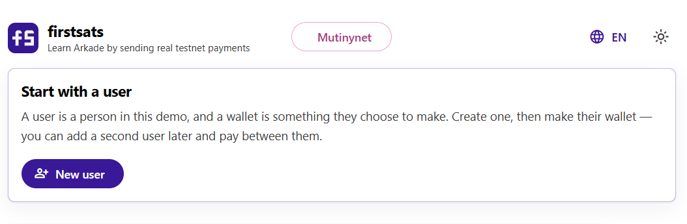
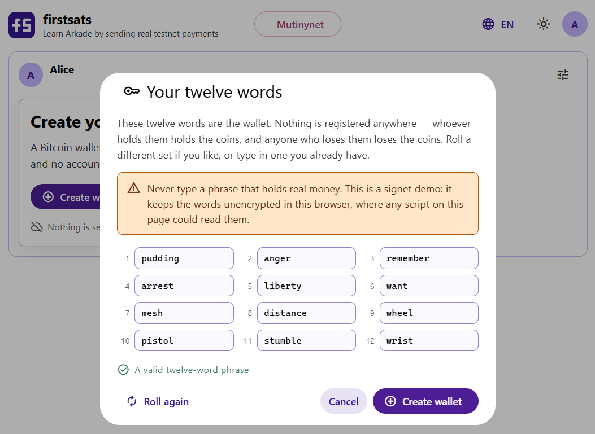
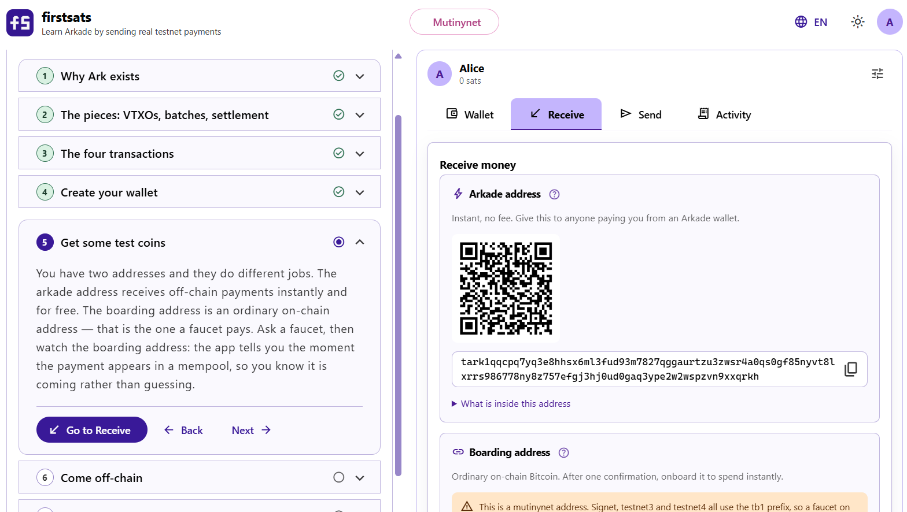
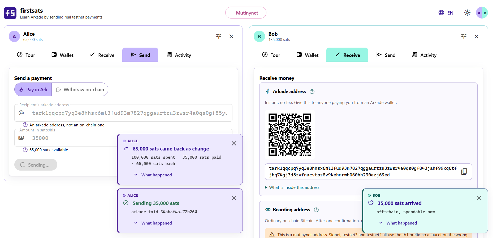
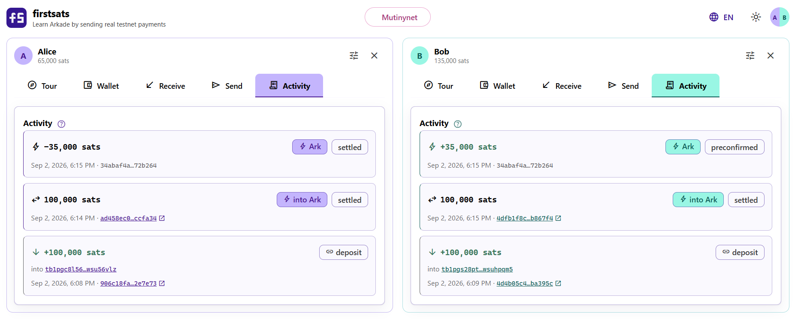
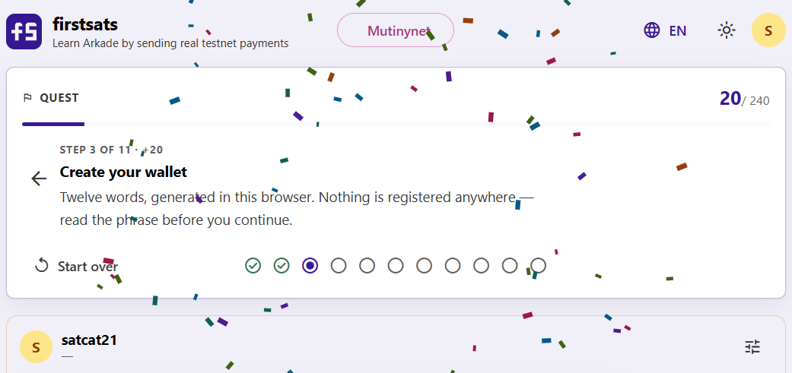

# firstsats

**A reference application for the [Arkade](https://github.com/arkade-os) TypeScript SDK — one that shows its work.**

Two front ends, one core: a **command-line wallet** and an **Angular web app**,
both driving the same domain code.

Create a Bitcoin wallet, receive money, send it instantly for no fee, and see
exactly what the protocol did at every step. Built for two audiences at once:
someone new to Bitcoin who wants the concepts to land, and a developer who wants
to see what using [`@arkade-os/sdk`](https://github.com/arkade-os/ts-sdk)
actually looks like.

### ▶ [Try it live](https://satcat21.github.io/firstsats/)

The web app, in your browser, on a public Arkade test deployment — no install,
no sign-up, and no coins of value. It opens on mutinynet and you can switch to
signet from the header.

```
$ firstsats send tark1qw8f... 5000

 ok  Sending 5,000 sats
     to tark1qw8f4x2…9dk3mq

     behind the scenes
     Your wallet picks VTXOs worth at least the amount, builds an Arkade
     transaction that destroys them and creates new ones (the payment plus
     your change), and asks the server to co-sign. No block is involved.

 ok  Sending 5,000 sats (1 second)
     arkade txid a3f91b2c…7e21cd

     behind the scenes
     Done. The recipient can spend that VTXO immediately, even though
     nothing has touched the blockchain. It stays preconfirmed until the
     next batch round folds it in and makes it settled -- and until then
     it rests on the server not colluding with the sender to double-spend.
     Settling retires that assumption: the old outputs get forfeited to
     the server, and the forfeit is built so it cannot be used unless the
     new batch actually confirms on-chain.
```

That commentary is not decoration. It is a typed event stream that the test
suite asserts on, so the explanations cannot quietly drift away from what the
code does.

---

## Quick start

Requires Node.js 24.20.0 or newer — the active LTS line.

```bash
npm install
npm run firstsats -- init      # create a wallet, print your recovery phrase
npm run firstsats -- tour      # a walkthrough that adapts to your wallet's state
```

`tour` reads your actual balance and tells you the one thing worth doing next.
Follow it. It will send you to a faucet, then to `onboard`, then to `send`.

Defaults point at the **public Arkade mutinynet deployment**
(`mutinynet.arkade.sh`), which is live, free, and produces a block every thirty
seconds instead of every ten minutes. The coins are worthless, which is the
point. `FIRSTSATS_NETWORK=signet` switches to the ten-minute chain.

## The web app

**[Try it live](https://satcat21.github.io/firstsats/)** — no install,
no sign-up, no coins of value. It runs entirely in your browser against public
Arkade infrastructure, opening on **mutinynet**; the header switches between
mutinynet and signet, and the choice is remembered. Regtest is CLI-only — a
page served over HTTPS cannot call `http://localhost`.

```bash
npm run web          # dev server on http://localhost:4200
```

The same wallet with buttons and info tooltips instead of commands: guided
screens, the narration rendered as a live timeline beside whatever you are
doing, light/dark/system theming in Arkade Labs' own palette, and six languages
(English, German, Spanish, French, Italian, Portuguese) that switch instantly.

It is browser-only — no backend, so your recovery phrase never leaves the
device. `FirstSatsAccount`, the narration stream, the network presets and the
formatters are shared verbatim with the CLI; only seed storage, wallet
construction and rendering differ. See
[the web UI documentation](docs/04-web-ui.md).

### Screenshots

Moments from a real session, in the order you meet them.

**Starting out.** No wallet, no account, nothing registered anywhere — a user is
just a person in the demo, and the wallet is something they choose to make.

<p align="center">
  
</p>

**Choosing the twelve words.** Pressing a button and being handed a wallet
teaches nothing, so the phrase is shown as twelve editable fields: roll a
different set, or type in one you already have. The warning is prominent
because the one genuinely dangerous thing a beginner can do here is bring a
phrase that holds real money into a demo that keeps it unencrypted.

<p align="center">
  
</p>

**The guided tour, docked beside the wallet.** Nine chapters that never tell you
to do something you have already done: the reading chapters tick when you open
them, the rest are judged from what the wallet actually holds. Here it is open
at *Get some test coins* next to the Receive screen it is talking about, with
both addresses on show — the arkade one for instant off-chain payments, the
boarding one that a faucet pays.

<p align="center">
  
</p>

**Two wallets, side by side, mid-payment.** Alice pays Bob 35,000 sats off-chain
while both panes are on screen, so the payment can be watched from both ends.
Each user carries their own colour through their avatar, tabs and notifications,
and the narration toast says what just happened and offers the reasoning behind
it.

<p align="center">
  
</p>

**The same payment from both sides.** One arkade transaction, `34abaf4a…72b264`,
appearing as −35,000 for Alice and +35,000 for Bob. Below it, each wallet's own
history: the deposit that arrived on-chain, and the round that brought it into
Ark — separate actions, because they happened at different times for different
reasons. Only the on-chain ones carry an explorer link; an Ark payment has no
transaction to link to, which is the point of it.

<p align="center">
  
</p>

**Quest mode, part-way through a run.** The other way to use the app: eleven
tasks in order, from no wallet at all to coins taken back on-chain. Nothing is
ticked by pressing a button that says *done* — each task completes when the app
sees you actually do it, which makes the run an end-to-end test of the whole
flow as much as an onboarding. It is a separate room with its own users and
wallets, so free mode is untouched while you are in it and waiting when you
leave.

<p align="center">
  
</p>

## Commands

| Command | What it does |
| --- | --- |
| `init` | Create a wallet, or import one with `--import "twelve words…"` |
| `tour` | A guided walkthrough that adapts to where you actually are |
| `address` | Your arkade address and your boarding address, and the difference |
| `balance` | Your balance, split into the buckets that behave differently |
| `vtxos` | The individual virtual outputs behind that balance, with expiry countdowns |
| `receive` | Show your address and block until money arrives |
| `send` | Send sats off-chain to an arkade address |
| `onboard` | Turn confirmed on-chain funds into VTXOs |
| `offboard` | Withdraw off-chain funds back to an on-chain address |
| `history` | Past payments |
| `info` | The Arkade server's live parameters |
| `wallets` | List the wallets on this machine |

Global flags: `--wallet <name>`, `--json`, `--no-explain`, `--quiet`.

`--json` makes every command machine-readable, which is how you would drive this
from a script or another program.

## What you will actually learn

Running the flow once teaches four things that are hard to get from a
specification:

1. **A wallet is just twelve words.** `init` contacts nothing. The wallet exists
   before any server has heard of it.
2. **There are two kinds of address, and they are not interchangeable.**
   Pasting an on-chain address into `send` is the most common beginner mistake;
   this app catches it and explains why `offboard` is the thing you wanted.
3. **A balance is not one number.** `settled`, `preconfirmed`, `boarding`,
   `recoverable` and `available` mean genuinely different things. `available` is
   the honest one.
4. **Exactly one step touches the blockchain.** Onboarding. Everything after it
   is instant and free — and the price of that is an expiry you must come back
   before.

## Documentation

- **[How Ark works](docs/01-how-ark-works.md)** — VTXOs, batch rounds, forfeit
  transactions and connector outputs, expiry, unilateral exit, and an honest
  comparison with Lightning. Draws on
  [Neha Narula's write-up](https://nehanarula.org/2025/05/20/ark.html) and
  [Bitcoin Magazine's technical overview](https://bitcoinmagazine.com/technical/bitcoin-layer-2-ark).
- **[The payment flow, step by step](docs/02-payment-flow.md)** — each command
  mapped to what the protocol does.
- **[Architecture](docs/03-architecture.md)** — how the code is organised, why
  narration is an event stream, and how to add a command.
- **[The Angular web UI](docs/04-web-ui.md)** — why browser-only, what is shared
  with the CLI, theming, internationalisation and the security trade-offs.

## Using it as a library

The CLI is one consumer of `src/`. Nothing outside `src/cli/` touches stdout.

```ts
import { openSession, Narrator } from "arkade-firstsats";

const narrator = new Narrator();
narrator.on((step) => {
    // Render however you like: a terminal, a timeline, a websocket frame.
    console.log(step.status, step.title, step.behindTheScenes);
});

const session = await openSession({ walletName: "alice", narrator });

const { arkade } = await session.account.addresses();
const balance = await session.account.balance();
await session.account.send("tark1…", 5_000);

await session.close(); // releases the server subscription
```

## Configuration

Every setting is optional. See [`.env.example`](.env.example).

| Variable | Default | Purpose |
| --- | --- | --- |
| `FIRSTSATS_NETWORK` | `mutinynet` | `signet`, `mutinynet` or `regtest` |
| `FIRSTSATS_ARK_SERVER_URL` | per preset | Override the Arkade server |
| `FIRSTSATS_ESPLORA_URL` | per preset | Override the on-chain data source |
| `FIRSTSATS_DATA_DIR` | `.firstsats` | Where keystores are written |
| `FIRSTSATS_E2E` | unset | Set to `1` to enable the live integration suite |

## Development

```bash
npm run lint        # biome: format + lint
npm run typecheck   # tsc --noEmit
npm test            # unit suite -- no network, under a second
npm run test:e2e    # live signet integration (opt-in)
npm run audit       # npm audit on the production tree
npm run verify      # all of the above, in the order CI runs them

npm run web         # Angular dev server
npm run web:build   # production web bundle
npm run verify:all  # verify + the web build
```

The repository is two npm projects: the root (core + CLI) and `apps/web` (the
Angular front end), each with its own lockfile. Both pin **npm 12** via
`packageManager`.

The unit suite runs the entire payment flow — guardrails, view mapping and every
narration string — against a fake wallet in
[`test/fakes.ts`](test/fakes.ts). That is possible because `FirstSatsAccount`
depends on a narrow `WalletLike` interface rather than the SDK's concrete
`Wallet` class, which satisfies it structurally.

### CI

Both pipelines run the same four gates — install, lint, audit, build:

- [`.gitlab-ci.yml`](.gitlab-ci.yml) — GitLab, including a manual tag-gated
  publish to a private GitLab npm registry.
- [`.github/workflows/ci.yml`](.github/workflows/ci.yml) — GitHub Actions, on a
  Node 24.20.0 / 26 matrix, plus a job that builds the web app.
- [`.github/workflows/codeql.yml`](.github/workflows/codeql.yml) — CodeQL static
  analysis of this repository's own code.
- [`.github/dependabot.yml`](.github/dependabot.yml) — continuous dependency
  updates.

`npm audit` and GitHub's own analysis answer different questions and are both
worth having: audit gates the build at the moment of change, Dependabot watches
the lockfile continuously and opens a PR when a fix lands, and CodeQL inspects
this project's code rather than its dependencies.

### Publishing

`.github/workflows/pages.yml` builds the web app and publishes it to GitHub
Pages on every push to `main`. The app is static -- no backend, no router, no
server-side rendering -- so the only deploy-specific detail is Angular's
`--base-href`, which the workflow takes from the repository name so a fork
publishes correctly without editing anything.

```bash
npm run web:build:pages    # the same build locally, base href and all
```

The network is chosen at build time (see [Configuration](#configuration)), so a
published site is fixed to whichever deployment it was built against.

## Security

**This is a demo. Do not put real money in it.** The CLI stores seeds
unencrypted on disk and `init` prints the recovery phrase to stdout; the web app
keeps the seed in `localStorage`, where any script on the origin can read it.
These are deliberate simplifications, acceptable only because every network on
offer is a test network, where coins are worthless.

See [SECURITY.md](SECURITY.md) for the full policy and how to report a
vulnerability privately.

## License

MIT. See [LICENSE](LICENSE).

Built on [`@arkade-os/sdk`](https://github.com/arkade-os/ts-sdk) by
[Ark Labs](https://github.com/arkade-os). This project is an independent
community demo and is not an official Arkade release.
