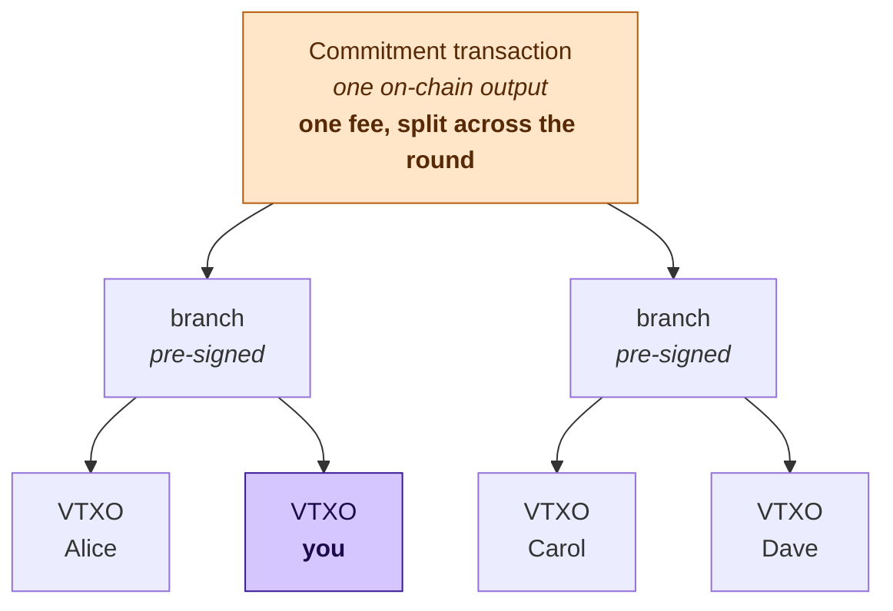
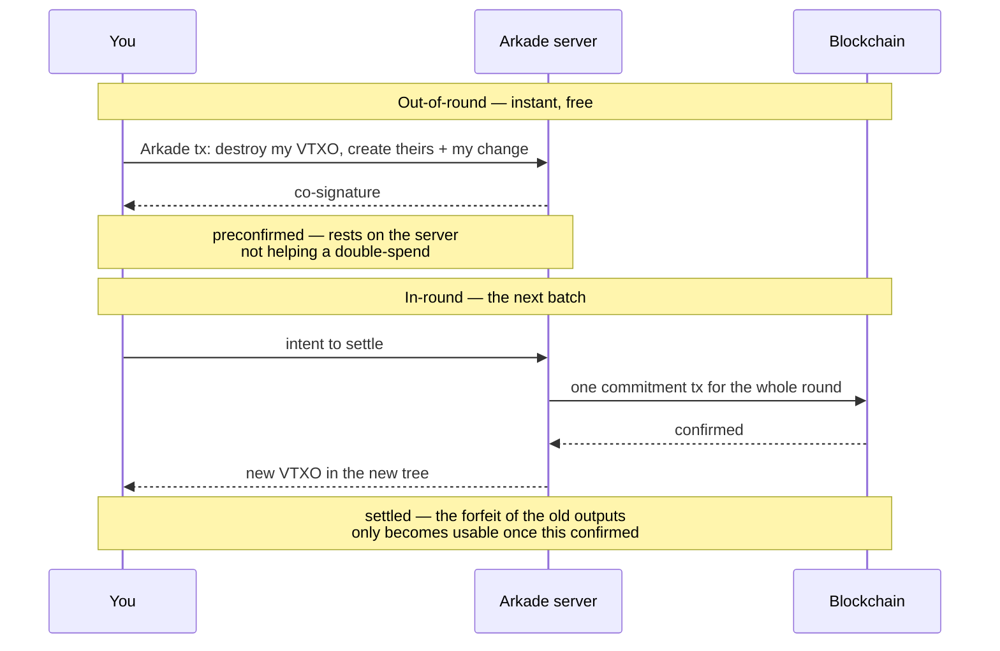
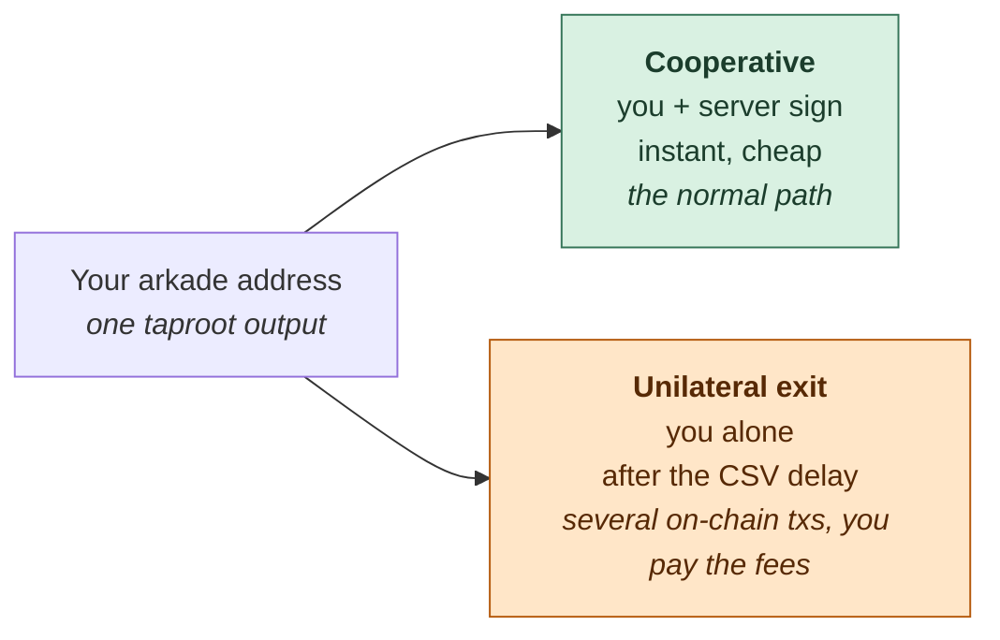

# How Ark works

You do not need this page to run the demo. You need it to understand what the
demo is showing you.

Sources for the protocol description below: Neha Narula's
[write-up of the Ark protocol](https://nehanarula.org/2025/05/20/ark.html) and
Bitcoin Magazine's [Bitcoin Layer 2: Ark](https://bitcoinmagazine.com/technical/bitcoin-layer-2-ark).
Anything specific to *Arkade* — the implementation this app is built against —
is marked as such, and comes from the
[Arkade TypeScript SDK](https://github.com/arkade-os/ts-sdk).

---

## The problem

A Bitcoin UTXO is a coin that exists in a block. To pay someone, you spend it
and create a new one, and that costs a transaction in a block. Blocks are
scarce, so this does not scale to everyday payments.

Lightning solves this with channels: you and one counterparty lock funds
together and update a private balance between you. It works, but it imposes
two costs that hurt newcomers badly:

- **Receiving requires inbound liquidity you must acquire in advance.** A brand
  new wallet cannot be paid until someone has committed capital toward it.
- **Both ends must be online**, and payments must be routed across a graph of
  channels that may or may not have capacity in the right direction.

Ark attacks the same problem from the opposite side.

## The core idea: share one UTXO, keep your own exit

Instead of each user owning their own on-chain UTXO, **many users share one**.
A single on-chain transaction — Arkade calls it the **commitment transaction**,
the papers call it the **round** transaction — creates one output that a whole
group of users collectively owns.

Underneath that shared output sits a **tree of pre-signed transactions**. The
root is locked to an n-of-n multisig of the server plus every user in the tree.
It splits, binary-tree style, down to one leaf per user. Your leaf is your
money.

That leaf is your **VTXO** — a virtual UTXO. Bitcoin Magazine's definition is
the precise one:

> pre-signed transactions that guarantee the creation of a real UTXO under the
> unilateral control of a user once submitted onchain, but are otherwise held
> offchain.

That is the whole trick. You hold signatures that *would* put a real UTXO under
your sole control if you broadcast them. You just don't broadcast them, because
you don't have to. In `firstsats`, `firstsats vtxos` lists exactly these.

Publishing your leaf would turn it into a real on-chain UTXO under your sole
control. You never need to, and that is the whole trick: the fee for the output
at the top was paid once, by everybody in the round together, and every payment
below it is free.

## Two ways to pay

### Out-of-round (instant)

You want to pay Bob right now. Your wallet builds a transaction spending your
VTXO to Bob's script, and the server co-signs it. Bob has a VTXO. Total elapsed
time: about a second. No block, no fee.

The catch, and it is the honest catch: until the next batch confirms, this rests
on the server not colluding with the sender to double-spend. Narula is blunt
about declining that assumption:

> I'm not interested in this assumption so I'm not going to go into detail on
> how this works.

This is precisely the state `firstsats balance` reports as **preconfirmed**. It
is real money you can spend onward, and it is not yet finalized. Watching a
balance move from `preconfirmed` to `settled` is watching that assumption get
retired.

*Arkade specific:* the SDK does not co-sign a bare spend. An off-chain send
creates a **checkpoint** output (see `checkpointTapscript` in the server info
that `firstsats info` prints) alongside the payment, which is what the next
batch consumes.

### In-round (settled)

The server runs batch rounds on a fixed cadence — the public signet deployment
uses a 60-second session, which `firstsats info` will show you. In a round, the
server collects everyone's requests, builds one new commitment transaction with
a fresh tree, and puts it on-chain.

Your old VTXO has to be cancelled, or you would hold two claims on the same
money. You cancel it by signing a **forfeit transaction** that hands the old
leaf to the server.

This creates an obvious atomicity problem: what stops the server from taking
your forfeit and never publishing the new round, freezing your funds? The
answer is the **connector output**:

> each forfeit takes a dust-value output created only in the new round as an
> additional input. This ensures forfeits cannot be broadcast until the round
> confirms on-chain.

The forfeit is unspendable until the round it depends on exists. You cannot be
robbed by a server that takes your signature and walks away.

### The two paths side by side

## Expiry, and why your wallet must come back

This is the part newcomers miss, so the demo puts it in front of you.

**A batch expires.** Every tree has a lifetime. When it ends, the server can
sweep whatever is still sitting in it. `firstsats vtxos` prints a countdown per
VTXO for exactly this reason.

Before that deadline you must either spend the VTXO or **refresh** it — hand it
back in a new round and receive a fresh leaf in the new tree. The SDK does this
for you (`settlementConfig` controls the threshold), but the requirement is
structural, not a detail of this implementation: **Ark requires you to come
online periodically or lose the money.** Lightning does not have this property,
and Narula names it as one of Lightning's advantages.

There is a second, unrelated timelock. The **exit delay** (`δ`, roughly two days
in the papers; `firstsats info` prints the live value as `unilateral exit`) is a
relative timelock on unilateral exits. It exists so that if you broadcast a
*stale* exit path, the server has a window in which to broadcast the matching
forfeit and stop you.

## Unilateral exit: the actual guarantee

If the server stops answering — goes down, gets seized, decides it dislikes you
— you are not asking anyone's permission to get your money.

You broadcast the chain of pre-signed transactions from the tree root down to
your leaf, wait out the exit delay, and spend the resulting UTXO. That path was
signed when the round was built and nobody can revoke it.

This is what "non-custodial" means here, and it is worth being exact about what
it costs:

- Exiting may take **several on-chain transactions**, so it can cost more than a
  plain payment would have.
- You need **other coins to pay those fees**. A wallet holding only VTXOs cannot
  fee-bump its own escape. Keep a little on-chain change around.
- **You must still hold your exit data.** Narula: "Ark relies on users to hold
  their exit paths (if they lose this data, then they can't exit the Ark
  non-cooperatively)." The SDK persists this, which is why the storage
  repositories in `src/wallet.ts` are not an incidental choice.

`firstsats offboard` demonstrates the *cooperative* exit, which is cheap and
fast because the server helps. The unilateral path is the one that makes the
cooperative path safe to rely on.

The second path is the reason the first one is safe to rely on. The server can
stall you; it cannot keep your money.

## What the server must put up

The server is not custodying your money, but it is spending its own. To settle a
round it funds new outputs before the old batch expires and its capital comes
back. Narula:

> S must provide liquidity equal to total payment volume throughout each refresh
> period.

Which produces the central design tension:

> a shorter refresh period is better for liquidity costs to the server (and
> thus, presumably, Ark fees which get passed on to users) but this means users
> have to come online more often.

That is the knob. Every Ark deployment picks a point on it, and `firstsats info`
shows you which point this one picked.

## Ark versus Lightning, honestly

**Where Ark wins**

- A brand new wallet can be paid immediately. No inbound liquidity, no channel
  to open, no capital committed on your behalf. For onboarding, this is the
  whole argument.
- No routing, no channel balancing, no path-finding failures.
- With CTV, a recipient need not even be online to receive.

**Where Lightning wins**

- Missing a deadline is survivable. In Ark, missing your refresh window costs
  you the money.
- Lower latency, and genuinely peer-to-peer — Ark payments are intermediated by
  the server.
- Ark's on-chain footprint is proportional to volume. Batches amortise it, but
  Bitcoin Magazine's point stands: Ark "inherently requires a proportional
  amount of blockspace use," while Lightning's volume need not appear on-chain
  at all.

The two are not competitors so much as opposite trade-offs against the same
constraint.

## Where soft forks would help

Today's Ark is interactive: users must be online while a round is constructed to
sign into the tree. Narula: "Not only is it pretty interactive to make a
payment, the users have to be online for the whole duration of the round."

- **CTV** removes the multisig requirement inside the tree. Recipients can be
  paid while offline and need only verify their exit path before expiry.
- **CTV + CSFS** gives rebindable signatures, letting users sign forfeits
  *before* the tree is built — which removes the be-online-for-the-whole-round
  requirement, the sharpest usability edge Ark currently has.

## Glossary, mapped to what you will see in this app

| Protocol term | Arkade / SDK term | Where you see it |
|---|---|---|
| Round transaction | Commitment transaction | txid printed by `onboard` |
| ASP (Ark Service Provider) | Arkade server / signer | `firstsats info` |
| VTXO leaf | VTXO | `firstsats vtxos` |
| Out-of-round payment | Preconfirmed / off-chain send | `firstsats send` |
| In-round settlement | Batch / settlement | `settled` in `firstsats balance` |
| Refresh period | Batch expiry | expiry countdown in `firstsats vtxos` |
| Exit delay (δ) | `unilateralExitDelay` | `firstsats info` |
| Cooperative exit | Offboarding | `firstsats offboard` |

---

Next: [the payment flow, step by step](./02-payment-flow.md).
