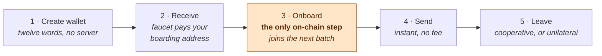

# The payment flow, step by step

This walks the same path `firstsats tour` walks, but with the protocol
mechanics named. If a term here is unfamiliar, it is defined in
[How Ark works](./01-how-ark-works.md).

---



Only one box in that row touches the blockchain, and its cost is shared with
everybody else in the same batch round.

## Step 1 — Create a wallet

```bash
npm run firstsats -- init
```

Twelve BIP-39 words are generated and written to `.firstsats/default.wallet.json`.

**What happened on the network: nothing.** No account was registered, no server
was contacted, nobody granted permission. The wallet existed the moment the
entropy was drawn. This is worth pausing on if you are new to Bitcoin — it is
not how any other payment system you have used works.

The seed derives a BIP-86 Taproot key. That is a standard derivation, not an
Arkade-specific one, so the same words work in other Bitcoin wallets.

Code: [`src/keystore.ts`](../src/keystore.ts), [`src/session.ts`](../src/session.ts).

> This demo stores the mnemonic **unencrypted**. That is a deliberate
> simplification so the interesting code stays visible. Use testnet coins only.

## Step 2 — Get two addresses

```bash
npm run firstsats -- address
```

You get two, and the difference matters:

| | Arkade address (`ark1…`) | Boarding address (`tb1…`) |
|---|---|---|
| Receives | Off-chain payments from Arkade wallets | Ordinary on-chain Bitcoin |
| Speed | ~1 second | One block confirmation |
| Fee to receive | None | Normal miner fee, paid by sender |
| Result | A VTXO, spendable immediately | An on-chain UTXO that must be onboarded |

Both are Taproot outputs from the same seed. The arkade address commits to a
script with two spending paths: one you and the server can take together, and
one only you can take after a timelock. That second path is the unilateral exit,
and it is the reason the first path is safe to use.

Code: [`FirstSatsAccount.addresses`](../src/account.ts).

## Step 3 — Receive money

```bash
npm run firstsats -- receive
```

This subscribes to the server's event stream and blocks. Two things can arrive:

**A VTXO** — someone paid your `ark1…` address. It lands in about a second, with
no on-chain transaction. `firstsats balance` will show it as `preconfirmed`: real
and spendable, not yet finalized in a batch.

**An on-chain UTXO** — someone paid your boarding address. Now you need step 4.

Code: [`FirstSatsAccount.waitForFunds`](../src/account.ts).

## Step 4 — Onboard (the only on-chain step)

```bash
npm run firstsats -- onboard
```

Your wallet registers an intent with the server and waits for the next batch
round. The server builds **one commitment transaction covering everyone in that
round**, and your share becomes a leaf in its tree.

This takes about a minute on the public signet deployment — one batch session —
because it is genuinely waiting for a block-bound event. It is also the *only*
step in this entire flow that touches the blockchain.

The cost story is the point: whether one person or five hundred onboard in that
round, it is one on-chain transaction. Your share of the fee falls as the round
fills.

Code: [`FirstSatsAccount.onboard`](../src/account.ts), which calls the SDK's
`Ramps.onboard`.

## Step 5 — Send a payment

```bash
npm run firstsats -- send ark1qexample... 5000
```

Before anything is signed, the app checks three things — see
[`FirstSatsAccount.send`](../src/account.ts):

1. The amount is a whole number of satoshis above zero.
2. The address actually decodes as an arkade address. Pasting an on-chain
   address here is a common beginner mistake, and it gets a specific error
   pointing at `offboard` instead.
3. The amount clears the network's dust limit, and you have that much
   `available` — not `total`, which includes buckets that cannot be spent.

Then the wallet selects VTXOs, builds an Arkade transaction destroying them and
creating the payment plus your change, and the server co-signs.

**No block. No miner fee. About one second.**

Run `firstsats vtxos` before and after. The coin you spent is gone and two new
ones exist. That is a UTXO model behaving exactly like a UTXO model — the only
difference is where the outputs live.

The recipient's new VTXO is `preconfirmed` until the next round folds it in.
They can spend it onward immediately regardless.

## Step 6 — Watch it settle

```bash
npm run firstsats -- balance
```

Five numbers, and they are not five ways of saying the same thing:

| Bucket | Meaning |
|---|---|
| `settled` | Finalized inside a confirmed batch |
| `preconfirmed` | Accepted instantly; next round will finalize it |
| `boarding` | Still an ordinary on-chain coin; run `onboard` |
| `recoverable` | Expired or dust outputs you can reclaim in a future batch |
| `available` | What `send` can actually spend **right now** |

`available` is the honest number. `total` includes money that is yours but not
currently spendable, which is why this app never leads with it.

Watching `preconfirmed` become `settled` is watching the no-collusion assumption
described in [How Ark works](./01-how-ark-works.md) get discharged.

## Step 7 — Leave

Two exits, and you should know both exist.

**Cooperative** (`firstsats offboard tb1…`) — you hand your VTXOs back in a batch
and the server pays you out on-chain in the same commitment transaction. Cheap
and quick, and it requires the server to play along.

**Unilateral** — you broadcast your pre-signed exit path yourself, wait out the
exit delay, and take the funds. Works if the server never speaks to you again.
This demo does not automate it (the SDK exposes the primitives), but its
existence is what makes everything above non-custodial rather than a promise.

Run `firstsats info` to see this deployment's actual exit delay.

## The thing to take away

Six steps. Exactly one touched the blockchain, and that one was shared with
everybody else in the round. Every payment after it was instant and free, and at
no point did anyone else hold your money.

The cost of that: you must come back online before your batch expires, and you
must keep your exit data. Those are real obligations, not fine print — which is
why this app shows you the expiry countdown rather than hiding it.
